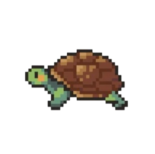

<H1>🌟 Apresento com alegria o jogo Turtle! 🐢</H1>  

<strong>Turtle: Explorando o Espaço com Simplicidade e Diversão</strong>
 

 
Turtle é um jogo envolvente que transforma a exploração do espaço em uma experiência divertida e interativa. Desenvolvido com Python e a biblioteca Turtle, este jogo oferece uma maneira intuitiva e cativante de controlar uma tartaruga usando as teclas 'W', 'A', 'S' e 'D'.

Ao iniciar o Turtle, os jogadores são recebidos por um ambiente dinâmico, onde a tartaruga pode se mover livremente. Cada toque nas teclas revela uma nova direção, proporcionando uma experiência imersiva e prazerosa.

O destaque do Turtle é a sua simplicidade e acessibilidade. Com controles fáceis de aprender, qualquer pessoa pode começar a jogar e se divertir imediatamente. A combinação da linguagem Python com a biblioteca Turtle permite que os movimentos sejam suaves e responsivos, melhorando a experiência geral do jogo.

Além da jogabilidade fluida, o Turtle oferece um design visual agradável e uma interface amigável, garantindo que os jogadores tenham uma experiência consistente e agradável.

Em resumo, o Turtle não é apenas um jogo de exploração espacial. É uma jornada divertida e envolvente, onde cada movimento da tartaruga é uma oportunidade para descobrir novos horizontes. Com sua combinação de simplicidade e design cativante, o Turtle eleva a experiência de jogar a novos patamares, oferecendo uma diversão única e memorável para todos os jogadores.

O Turtle, seu novo jogo de exploração espacial, já está disponível e pronto para jogar! Movimente-se pelo espaço com facilidade e descubra o prazer de controlar sua própria tartaruga espacial!

<h4>Desenvolvido pela Linguangem:</h4>
<ul>
	<li></li>
</ul>
